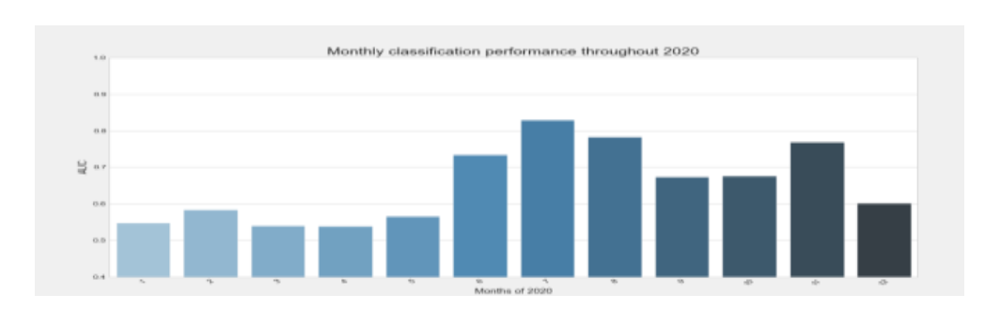

+++
title = "Reducing Crop Burning to Improve Air Quality in India"
date = 2021-09-01
draft = false
tags = ["Social Impact", "Machine Learning", "Remote Sensing", "Satellite Data", "Python", "Google Earth Engine", "Solve for Good"]
categories = ["Social Impact"]
description = "A Solve for Good collaboration with Energy Harvest Charitable Trust: using satellite imagery, ground-truth data collection, and AI to detect and reduce crop residue burning in India"
+++

## Solve for Good × Energy Harvest Charitable Trust

**Programme**: [Solve for Good](https://www.solveforgood.org)
**NGO Partner**: [Energy Harvest Charitable Trust](https://www.energyharvesttrust.com), Punjab, India
**Academic Partners**: Carnegie Mellon University · University of Southampton
**Industry Partner**: Google
**Repository**: [ProdigyNumbers/energy\_harvest\_trust](https://github.com/ProdigyNumbers/energy_harvest_trust)

---

> **My role on this project** covered the AI and machine learning components — feature engineering from satellite SAR data, model development for crop-type classification, and evaluation. The broader project (ground-truth data collection, Carbon2Climate platform, and policy advocacy) was a collaborative effort across the Solve for Good team and partner organisations.

---

### The Problem

India produces **500–550 million tonnes of crop residue** every year. The majority is burned in the fields by farmers — a practice that is fast, cheap, and deeply entrenched, but responsible for catastrophic air pollution across northern India every winter. The resulting particulate matter causes public health emergencies and contributes to long-term environmental damage.

**Energy Harvest Charitable Trust (EHS)** was founded specifically to tackle this problem: educating and training farmers to manage stubble, increasing their income through alternative uses for crop waste, and advocating for policy change.

The challenge for AI: the scale and impact of crop burning are massive, but the *specifics* — what is being burned, how much, where, and when — are largely unknown to policymakers and advocates. Without accurate, timely, granular data, designing effective interventions is impossible.

---

### Three Pillars of the Project

1. **Detection** — Identify fire locations and timing, estimate biomass quantities, classify crop types
2. **Intervention** — Build a marketplace connecting farmers, collectors, and crop residue buyers
3. **Policy Advocacy** — Inform government about burning areas and advocate for structural policy change

---

### Ground Truth Data Collection

A key early challenge: AI models require labelled training data, and no reliable systematic ground-truth dataset existed for crop fires and field types in Punjab.

, Google Earth polygon marking, and open-source app (180+ records)")

Three data collection approaches were developed and deployed:

**Approach 1 — Custom web app**
- Purpose: marking fire points and paddy/non-paddy fields (straight lines or polygons)
- Geography: Punjab, India
- Scale: **450+ records** collected by field team
- Challenge: low-data connectivity in farmland areas caused data loss when offline

**Approach 2 — Google Earth**
- Purpose: marking paddy fields and fire point locations
- Geography: Punjab, India
- Scale: **20+ records** — useful for validation but not scalable

**Approach 3 — Open-source polygon marking app**
- Purpose: crop identification (paddy, cotton stalks, agro-forestry, open fields)
- Geography: Punjab, India
- Scale: **180+ records** — no connectivity issues, scalable for further collection

In total, **700+ on-the-ground data collection points** were mapped across fire locations and crop types.

---

### Carbon2Climate: Real-Time Fire Reporting Platform

To consolidate fire identification and reporting, the **Carbon2Climate** platform was developed. It extracts real-time fire point data from **NASA's VIIRS (Visible Infrared Imaging Radiometer Suite)**, organised using the latest state and UT boundaries of India.

The platform allows stakeholders to:
- Search and compare fire point data by state or district
- View historical and current fire data on an interactive dashboard
- Set preferences for monitoring specific regions

Coverage was extended beyond Punjab to **Punjab, Haryana, Madhya Pradesh, Uttar Pradesh, Andhra Pradesh, and Jharkhand**, with over **900,000 fire points mapped** for 2020 and 2021.

---

### AI Crop-Type Identification

#### Data Extraction

Using **Google Earth Engine** and **NASA FIRMS** data, satellite imagery was extracted for labelled fields:
- **505 Paddy fields**
- **316 Non-harvesting fields**
- **64 Cotton fields**

#### Features

SAR (Synthetic Aperture Radar) data from **Sentinel satellite** proved far more effective than RGB imagery — SAR is unaffected by cloud cover, which is a persistent problem during the Indian monsoon season. Features extracted:

- **VH and VV backscatter** (polarised electromagnetic values, 10 m pixel resolution)
- Soil moisture
- Land surface temperature
- **NDVI** (Normalized Difference Vegetation Index)

VH backscatter emerged as the primary discriminating feature, showing clear and consistent seasonal differentiation between paddy, cotton, and non-field areas during the July–November harvesting season.

 diverge clearly from cotton and non-field areas during the July–November harvest window")

 vs July (harvest season) — the separation between paddy and non-paddy widens significantly during harvest")

#### Model

**Classification task**: distinguish Paddy fields from Non-Field areas using Sentinel SAR data (10 m pixel samples, last 3 months of historical data).

**Model**: Generalised linear model with **L1 regularisation (Lasso)**, chosen for interpretability and robustness on small, high-dimensional feature sets.

**Evaluation**: **AUC under the ROC curve** — a macro metric measuring the model's ability to separate paddy from non-paddy. AUC = 0.5 corresponds to random predictions (naive baseline).

---

### Impact

- **900,000+ fire points** mapped across six Indian states for 2020–2021
- **700+ on-the-ground data collection points** for fires and crop types
- **50+ tonnes of straw** collected from farmers during ground data collection, generating **7% income increase** for participating farmers and directly preventing burning
- Preliminary evidence that satellite-based crop classification is feasible and scalable across Punjab

---

### Limitations & Next Steps

The model was validated on Punjab data — generalisation to other states is future work. Fire detection relies on FIRMS which has known spatial resolution constraints, and ground-truth label collection carries selection bias risk.

**Next steps**:
- **Intervention**: develop a marketplace connecting farmers, collectors, and buyers of crop residue — making it economically rational *not* to burn
- **Prediction**: integrate the crop classification model into Carbon2Climate to forecast fires from historical patterns
- **Policy**: use the mapped data to inform state and national government on burning hotspots and advocate for structural incentives

---

**Domain**: Remote sensing · Crop monitoring · AI for social good · Environmental health · India

**Data**: NASA VIIRS FIRMS · Sentinel SAR (Google Earth Engine) · DHS ground-truth surveys

**Stack**: Python · Google Earth Engine · FIRMS · Jupyter notebooks · scikit-learn
