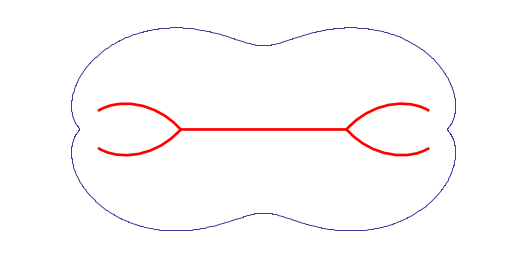
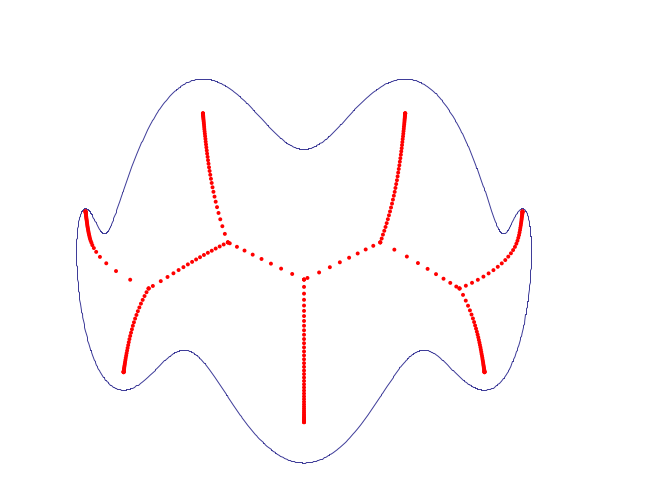
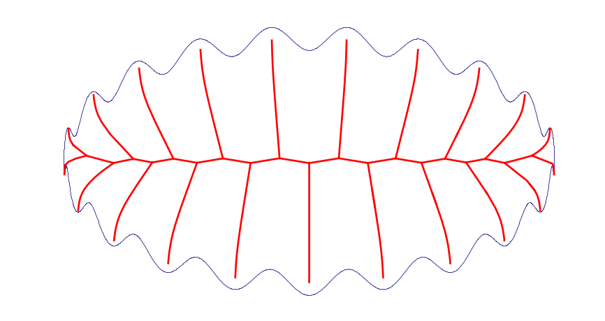
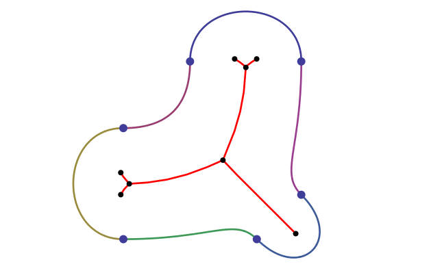

+++
title = "Certified Approximation of the Medial Axis of Smooth Curves"
date = 2006-01-01
weight = 4
draft = false
tags = ["Computational Geometry", "Algorithms", "C++", "Interval Arithmetic", "Research", "INRIA"]
categories = ["Research"]
description = "ACS technical report: a topologically correct algorithm for approximating the medial axis of smooth planar curves, using interval arithmetic to certify leaf and branch points"
+++

## ACS — Algorithms for Complex Shapes

**Report**: ACS Technical Report No. ACS-TR-36-26-02
**Authors**: Sunayana Ghosh · Gert Vegter
**Institution**: University of Groningen (RUG)
**Project**: [ACS — Algorithms for Complex Shapes with Certified Numerics and Topology](https://www-sop.inria.fr/prisme/ECG/Results/Reports.html), funded by the European Commission FP6 (2002–2006)
**Full paper**: [ResearchGate](https://www.researchgate.net/publication/241866030_Prototype_implementation_of_certified_approximation_of_the_Medial_Axis_of_smooth_curves)

---

### What is the Medial Axis?

Imagine you pour water into a shape drawn on a flat surface. The water spreads inward from all sides simultaneously. The **medial axis** is the set of points where the water from two or more sides meets at exactly the same moment — it is the skeleton of the shape.

More precisely: slide the largest possible circle inside a shape. As you move it around while keeping it touching the boundary, the centre of that circle traces the medial axis.

The result is an elegant, compact representation of the shape that captures its essential structure — the number of "arms", where they branch, and how they connect.

---

### Where is the Medial Axis Useful?

The medial axis turns up in a surprising range of fields:

- **Medical imaging** — extracting the centreline of blood vessels, airways, or bones from 3D scans, enabling surgeons to navigate and measure structures
- **Robotics** — planning paths for a robot moving through a corridor (stay on the medial axis and you stay as far from obstacles as possible)
- **Character recognition** — reducing handwritten letters to their skeletons for reliable comparison, regardless of stroke thickness
- **Animation & games** — rigging characters: the medial axis provides a natural skeleton for driving bone-based animations
- **CAD & manufacturing** — computing tool paths for CNC machining, where the cutter must stay centred within a pocket
- **Shape matching** — comparing two shapes by comparing their skeletons, which is more robust than comparing raw outlines

---

### The Challenge

Computing the medial axis is straightforward in theory, but hard to get right in practice. The main difficulty is **topological correctness** — ensuring the computed skeleton has the same structure as the true skeleton.

If the algorithm makes even a small numerical error, two branches that should be separate might appear to cross, or a branch might go missing entirely. For applications like surgical navigation or robot path planning, such errors are unacceptable.

At the time of this work, no existing algorithm for smooth curves could *guarantee* that its output was topologically correct — they could get close, but not prove it.

---

### The Approach

This work developed an algorithm that produces a **certified** approximation: it can mathematically prove that its output has the correct skeleton structure.

The key idea is to use **interval arithmetic** — instead of computing with single approximate numbers (which can silently accumulate errors), the algorithm tracks guaranteed bounds around every computed value. If it calculates that a point lies in the range [2.001, 2.003], it *knows* the true answer is in that range. This makes it possible to certify that different skeleton branches are truly separate and not just appearing separate due to floating-point luck.

The algorithm finds the "junction points" and "endpoints" of the skeleton first, determines how they connect (the topology), and then traces the branches between them — all with guaranteed correctness.

It was implemented and tested on a range of curves, from simple smooth shapes to highly complex boundaries with dozens of oscillations.

---

### Results

**Simple and moderate shapes** — the algorithm correctly recovers clean skeletons with the expected branching structure:

 has three branches meeting at a single junction point — exactly as expected from the shape's three-fold near-symmetry.")

**Complex shapes** — the algorithm was also tested on a highly oscillated curve (20 waves around an ellipse), first showing the raw discrete sample points, then the fully traced skeleton:

**Spline boundaries** — the algorithm was extended to shapes whose boundaries are made up of cubic spline curves (a common format in design software), and tested on two such shapes:

. The medial axis (red) has three branches meeting at a central junction — the skeleton of a y-shaped region.")

---

### In Short

This work solved a fundamental reliability problem in skeleton computation: for the first time, an algorithm could produce a medial axis approximation of a smooth curve and *prove* that its structure was correct — not just hope so. The full technical details are in the [paper](https://www.researchgate.net/publication/241866030_Prototype_implementation_of_certified_approximation_of_the_Medial_Axis_of_smooth_curves).

---

**Domain**: Computational geometry · Shape analysis · Certified numerics

**Stack**: C++ · Interval arithmetic · GNU GCC
