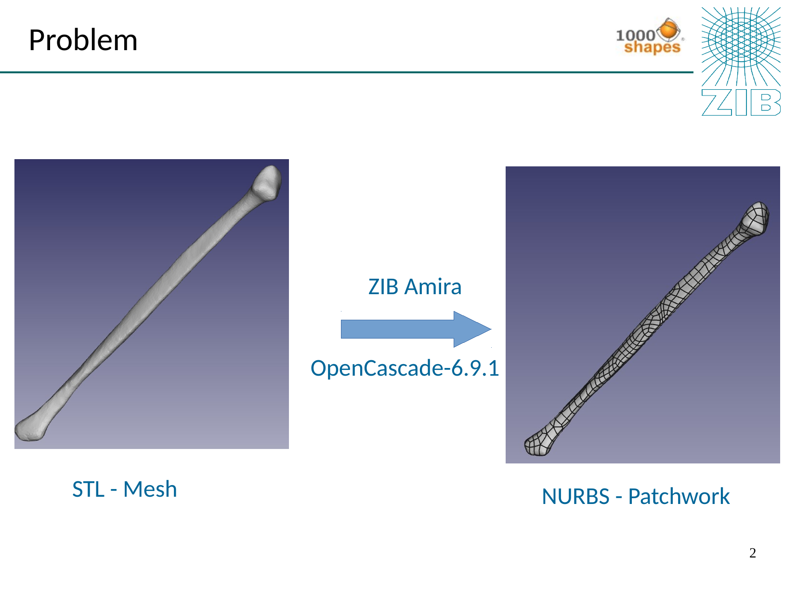
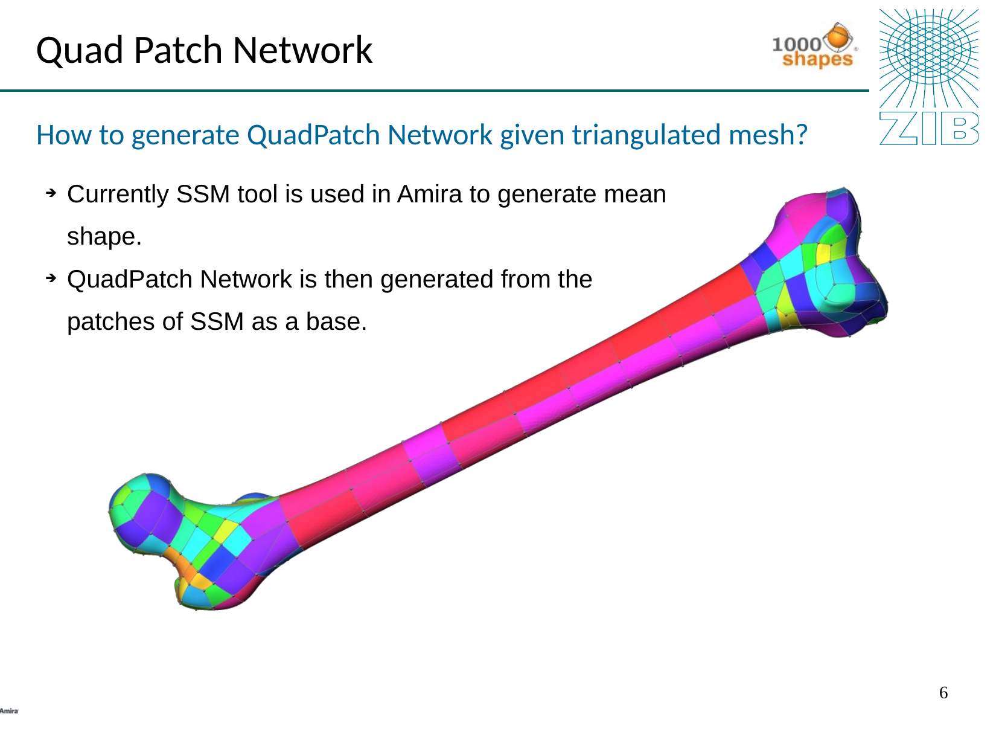
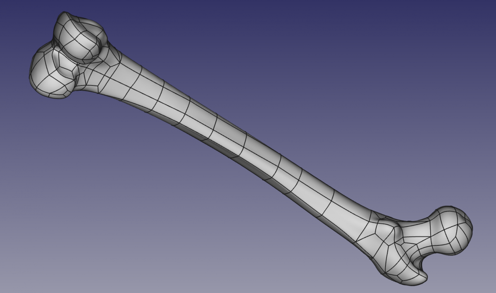

+++
title = "Mesh2NURBS: From Medical Scans to CAD Surfaces"
date = 2016-02-10
weight = 3
draft = false
tags = ["Medtech", "CAD", "NURBS", "Computational Geometry", "Research", "C++", "OpenCascade"]
categories = ["Research"]
description = "Feasibility study and prototype for automated conversion of discrete surface meshes to smooth NURBS surfaces for medical device CAD workflows, developed at Zuse Institute Berlin and 1000 Shapes"
+++

## Mesh2NURBS

**Presented**: Group Meeting, Zuse Institute Berlin, February 2016
**Collaborators**: T. Amiranashvili, M. Bindernagel, H. Lamecker, H. Ramm
**Institutions**: [Zuse Institute Berlin (ZIB)](https://www.zib.de) — Computational Medicine Group · [1000 Shapes](https://www.1000shapes.com) (ZIB spin-off)

---

### The Problem

Modern medical imaging (CT, MRI) produces detailed 3D surface meshes of anatomical structures. CAD systems used for designing implants and surgical instruments, however, require smooth **parametric surfaces** — specifically NURBS (Non-Uniform Rational B-Splines). Bridging this gap automatically and accurately is a fundamental challenge in patient-specific medical device manufacturing.

A triangulated STL mesh from a CT scan — for example a long bone — must become a structured NURBS surface suitable for CAD tools and biomechanical simulation. The challenge is making this conversion **automatic, accurate, and topologically valid**.

---

### Why NURBS?

NURBS surfaces are the standard representation in medical CAD for several reasons:

- **Simulation-ready** — naturally support deformation modelling of living tissue, effects of drugs on organs, and interaction with surgical devices
- **Implant design** — provide a smooth, controllable substrate for designing patient-specific artificial implants
- **Surgical device integration** — enable simulation of anatomical structures interacting with instruments and diagnostic tools
- **Compact** — significantly smaller file sizes than equivalent STL meshes

---

### Approach

The project was a feasibility study exploring automated conversion of triangulated surface meshes into smooth NURBS surfaces. The core insight is that NURBS surfaces require a **quadrilateral topology** as their foundation — they cannot directly fit over triangular meshes.

The approach proceeds in three conceptual stages:

1. Deriving a **quadrilateral patch network** from the input triangulated mesh
2. Fitting a smooth **NURBS surface patch** to each quad region
3. **Stitching** the individual patches into a coherent, watertight surface approximation

---

### Result

The prototype demonstrated that automatic mesh-to-NURBS conversion is feasible for anatomical geometry. The resulting surfaces are smooth, compact, and compatible with standard CAD workflows for medical device design.

---

### Relevance

This work connects directly to later roles:

- **Ottobock** — NURBS surface approximation for prosthetic socket fitting, where the same mesh-to-smooth-surface challenge appeared in a clinical production workflow
- **Fiagon** — 3D surface processing for surgical navigation, where accurate registration between patient anatomy and device geometry required the same geometric foundations

The core problem — bridging discrete geometry and smooth CAD representations — recurs throughout computational medicine, medical device engineering, and orthotics.

---

**Domain**: Medical technology · Computational geometry · CAD/CAGD · NURBS surface fitting

**Institutions**: [Zuse Institute Berlin](https://www.zib.de) · [1000 Shapes](https://www.1000shapes.com)
